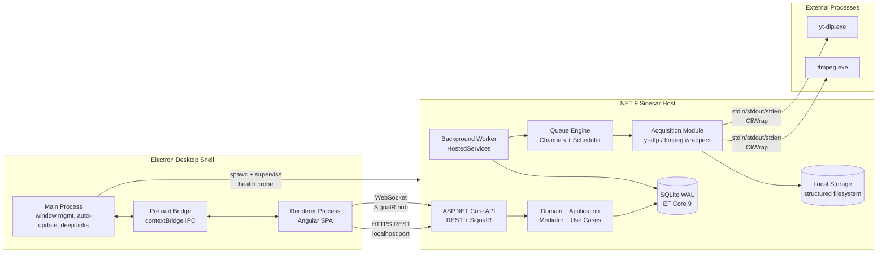
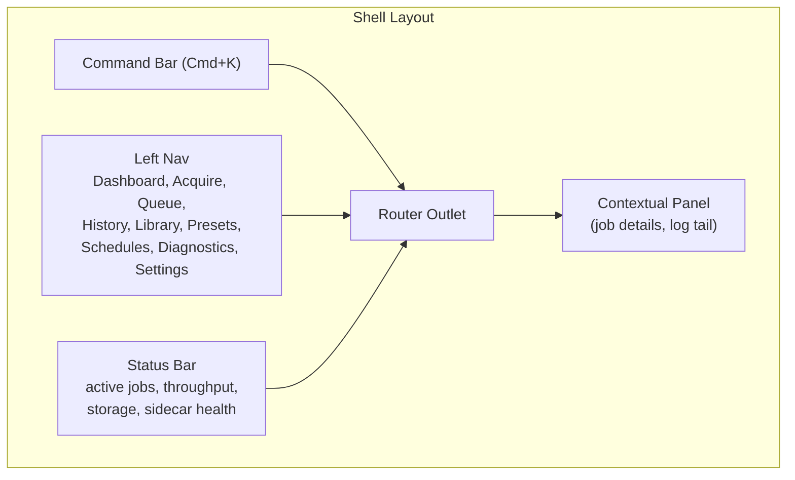
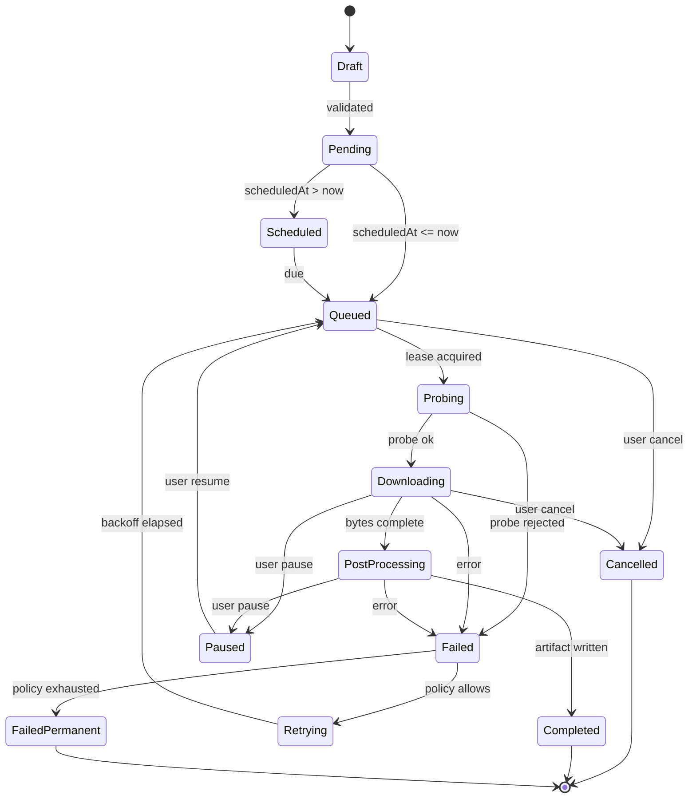
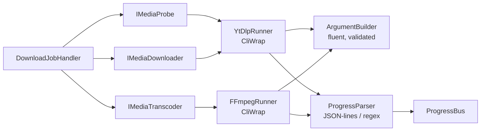

# MediaDock — Media Acquisition Platform Architecture

> Senior architecture review. Designed to be implemented in phases without throw-away rewrites. SaaS-migration ready from day one.

---

## 0. Decisions at a Glance

- **UI library:** **PrimeNG (latest, Aura theme)** — justified in §4.
- **Backend:** **.NET 9** sidecar process, **modular monolith** with clean architecture seams.
- **Process model:** Electron supervises a long-lived **.NET sidecar** (API + Worker in one host for desktop, splittable for SaaS).
- **Queue:** In-process **`System.Threading.Channels`** + **SQLite-backed durable state**, replaceable by Redis/RabbitMQ in Phase 4.
- **IPC:** Electron ↔ Angular via `contextBridge`; Angular ↔ .NET via **REST + SignalR**.
- **Process exec:** **CliWrap** (not raw `System.Diagnostics.Process`) for `yt-dlp` and `ffmpeg`.
- **State on UI:** **Angular Signals** + **`@ngrx/signals` SignalStores** for non-trivial slices; **TanStack Angular Query** for server state.
- **Persistence:** **SQLite (WAL mode)** via **EF Core 9**, structured logs to **Serilog → SQLite + rolling file**.
- **Packaging:** **electron-builder** (NSIS/DMG/AppImage), **.NET self-contained single-file** for the sidecar.

---

## 1. High-Level System Architecture

### 1.1 Layered topology



### 1.2 Layer responsibilities

- **Electron Main** — owns the window, system tray, global hotkeys, deep-link handlers (`mediadock://download?url=...`), auto-update via Squirrel/electron-updater, and **lifecycle of the .NET sidecar** (spawn on app start, health-probe `/health/ready`, graceful shutdown, crash supervision with backoff). Owns no business logic.
- **Preload bridge** — exposes a *narrow* `window.mediadock.*` API via `contextBridge`. Exposes only: app version, deep-link events, OS notifications, file-explorer reveal, theme state. **Never exposes Node `fs` or `child_process` directly.**
- **Angular renderer** — entire product UI. Talks to the sidecar over `http://127.0.0.1:<dynamic-port>` (port written to a per-user secret file at startup, with a one-time auth token).
- **ASP.NET Core API** — REST surface for queries/commands; SignalR hub `/hubs/jobs` streams progress, log lines, queue events. Auth = bearer token from the sidecar's secret file (Phase 1) → JWT/OIDC ready (Phase 4).
- **Background Worker** — `IHostedService`s: `JobRunner`, `Scheduler`, `RetryReaper`, `DiagnosticsCollector`, `BinaryUpdater`. Hosted in the **same process** as the API for desktop, splittable into a separate worker host for SaaS (same DI graph).
- **Queue engine** — bounded `Channel<JobEnvelope>` per worker class, **durable backing store in SQLite** so a crash never loses jobs. Scheduler reads due jobs and enqueues them.
- **Acquisition module** — anti-corruption layer over `yt-dlp` and `ffmpeg`. The rest of the system never sees their CLI semantics.
- **SQLite** — single source of truth for jobs, history, presets, settings, logs, schedules.
- **Local storage** — structured filesystem with templated paths, atomic moves, retention policy, trash folder.

### 1.3 Why this beats Electron + Node only

- **True parallelism for long jobs.** Node's single event loop bottlenecks under N concurrent CPU/IO-bound `ffmpeg`/`yt-dlp` pipelines. .NET gives us TPL, Channels, Server GC, async I/O without a single-threaded ceiling.
- **Process supervision is first-class.** `CliWrap` + Job Objects (Win) / process groups (POSIX) prevent zombie `yt-dlp` processes — a chronic Electron/Node pain point.
- **Type-safe domain.** A C# domain model with value objects, domain events, and aggregates is materially harder to express in TS without leaking through layers.
- **SaaS lift-and-shift.** The same modular monolith is hosted in a Generic Host today and a Kubernetes Deployment tomorrow. We do **not** rewrite anything to go SaaS — we just disable the desktop sidecar bootstrap and enable an Auth/Multitenancy module.
- **Mature ops.** OpenTelemetry, Serilog, EF Core, Polly, Quartz, MediatR, Wolverine — all production-hardened. The Node side has equivalents but the .NET stack is unified.
- **Clear renderer/server boundary.** Angular cannot accidentally call into Node primitives; the contract is HTTP/JSON+OpenAPI. This is the same shape we'd use for a web client on Day 1 of SaaS.

---

## 2. Production-Grade Folder Structure

Monorepo (PNPM workspaces + .NET solution). Pinned tooling via `mise`/`asdf` and a top-level `Directory.Packages.props` for central NuGet versioning.

```text
media-dock/
├── apps/
│   ├── desktop-shell/                    # Electron main + preload (TypeScript)
│   │   ├── src/main/                     # window, tray, deep links, auto-update
│   │   ├── src/preload/                  # contextBridge surface
│   │   ├── src/sidecar/                  # supervisor: spawn, health, restart
│   │   ├── resources/binaries/           # yt-dlp, ffmpeg per-OS (gitignored, fetched in CI)
│   │   ├── electron-builder.yml
│   │   └── package.json
│   │
│   ├── web/                              # Angular 19+ standalone app
│   │   ├── src/app/
│   │   │   ├── core/                     # auth, http, signalr, error, theme, telemetry
│   │   │   ├── shared/                   # ui primitives wrapping PrimeNG, pipes, dirs
│   │   │   ├── layout/                   # shell, sidebar, statusbar, command-bar
│   │   │   ├── features/
│   │   │   │   ├── dashboard/
│   │   │   │   ├── acquire/              # single + batch + paste-many
│   │   │   │   ├── queue/
│   │   │   │   ├── history/
│   │   │   │   ├── library/
│   │   │   │   ├── presets/
│   │   │   │   ├── schedules/
│   │   │   │   ├── cookies/
│   │   │   │   ├── diagnostics/
│   │   │   │   └── settings/
│   │   │   └── app.routes.ts
│   │   └── project.json
│   │
│   ├── api/                              # MediaDock.Api (ASP.NET Core host)
│   │   ├── Endpoints/                    # Minimal API endpoint groups
│   │   ├── Hubs/                         # SignalR hubs
│   │   ├── Auth/                         # local-token + future OIDC
│   │   └── Program.cs
│   │
│   └── worker/                           # MediaDock.Worker (separate host for SaaS)
│       └── Program.cs                    # composes Worker module only
│
├── packages/
│   ├── contracts/                        # Source-of-truth DTOs
│   │   ├── csharp/                       # C# records → emitted via NSwag
│   │   └── typescript/                   # generated TS client (do-not-edit)
│   ├── ui-kit/                           # Angular library: branded PrimeNG wrappers
│   ├── design-tokens/                    # CSS vars, Aura overrides, motion tokens
│   ├── icons/                            # custom SVG sprite + Lucide subset
│   └── eslint-config/                    # shared lint configs
│
├── src/                                  # .NET solution (modular monolith)
│   ├── MediaDock.Domain/                 # entities, value objects, domain events, no deps
│   ├── MediaDock.Application/            # use cases (MediatR), validators, ports
│   ├── MediaDock.Infrastructure/         # EF Core, FS, crypto, OS integration
│   ├── MediaDock.Acquisition/            # yt-dlp + ffmpeg wrappers, probers
│   ├── MediaDock.Queue/                  # channels, scheduler, retry, persistence
│   ├── MediaDock.Notifications/          # in-app + OS notifications
│   ├── MediaDock.Diagnostics/            # health, logs, metrics, snapshots
│   ├── MediaDock.Plugins.Abstractions/   # extension API surface (Phase 3)
│   └── MediaDock.Tests/
│
├── infrastructure/
│   ├── installers/                       # NSIS, DMG, AppImage assets, code-signing scripts
│   ├── ci/                               # GitHub Actions workflows
│   ├── packaging/                        # binary fetch + checksum scripts (yt-dlp, ffmpeg)
│   └── telemetry/                        # OTel collector config (Phase 3)
│
├── scripts/
│   ├── dev.ps1 / dev.sh                  # one-shot dev orchestrator
│   ├── gen-contracts.ps1                 # regenerate TS client from OpenAPI
│   ├── fetch-binaries.ps1                # pin + verify yt-dlp/ffmpeg per OS
│   └── release.ps1
│
├── docs/
│   ├── adr/                              # architecture decision records
│   ├── product/                          # positioning, personas, UX principles
│   ├── runbooks/                         # crash, corrupted db, ip-block playbooks
│   └── diagrams/
│
├── pnpm-workspace.yaml
├── nx.json                               # Nx for Angular workspace orchestration
├── Directory.Packages.props              # central NuGet versions
├── MediaDock.sln
└── package.json
```

Why this structure:
- `apps/` vs `src/` split keeps the **.NET solution self-contained** so JetBrains Rider/VS work natively.
- `packages/contracts` is the **single contract boundary** — DTOs are written in C#, OpenAPI emitted, TS client generated. Drift is impossible.
- `packages/ui-kit` ensures **PrimeNG is wrapped, never used raw** in features — protects against future library swaps.
- `apps/worker` is a stub today but proves the worker module composes alone; Day-1 SaaS readiness.

---

## 3. Backend Architecture (.NET 9)

### 3.1 Architectural style — Modular Monolith with Clean Architecture seams

Hexagonal at the **module** level, not at the class level. Each module exposes:
- **Domain** (pure C#, no infra references)
- **Application** (handlers, ports/interfaces)
- **Infrastructure** (adapters, EF mappings, process wrappers)
- **Public Contracts** (DTOs registered with the host)

Modules communicate **only via MediatR / Wolverine messages** — never direct cross-module method calls. This is what makes the SaaS lift painless: a module becomes a microservice by replacing the in-proc bus with a network bus.

### 3.2 Bounded contexts (modules)

- **Acquisition** — `DownloadJob`, `MediaSource`, `Format`, `ProbeResult`. Knows yt-dlp/ffmpeg.
- **Queue** — `JobEnvelope`, `JobLifecycle`, `RetryPolicy`, `ConcurrencySlot`. Knows nothing about media.
- **Library** — `MediaItem`, `Artifact`, `Tag`. Read-side projection of completed jobs.
- **Presets & Schedules** — `Preset`, `Schedule`. Templated job creation.
- **Sessions** — `BrowserCookieSource`, `Proxy`, `Identity`. Sensitive data, encrypted.
- **Diagnostics** — `LogEntry`, `HealthSnapshot`, `BinaryVersion`. Read-only views.
- **Notifications** — `Notification`, `Channel`. In-app + OS toast + (future) webhook.

### 3.3 Background processing strategy

- **Hosted services** as the only entry point for background work — never `Task.Run`.
- **One channel per worker class** (download, post-process, probe, scheduler-tick) with bounded capacity. Bounded channels apply backpressure naturally.
- **Persistent queue:** before a job is pushed to the channel, it is `INSERT`-ed (or transitioned) in SQLite within a transaction. On crash recovery the `JobRunner` rehydrates `Queued`/`Running` jobs back into the channel.
- **Concurrency governor:** `IConcurrencyGovernor` issues leases per-platform (`youtube=3`, `instagram=2`, `global=6`, configurable). Workers `await` a lease before claiming a job. Prevents IP-block patterns.
- **Cooperative cancellation** end-to-end via `CancellationTokenSource` linked from API → handler → CliWrap → child process → Job Object kill on dispose.
- **At-least-once execution** with idempotent handlers keyed by `JobId` + `Attempt`.

### 3.4 Failure recovery & retry

- **Polly** policies layered: retry (with jitter) → circuit breaker (per platform) → timeout → bulkhead.
- **Error taxonomy** in `Acquisition`:
  - `TransientNetworkError` → retry with backoff.
  - `RateLimited` → cooldown + governor reduces lease count.
  - `AuthRequired` → mark job `NeedsCookies`, surface to UI, do not retry.
  - `RemovedContent` → permanent fail.
  - `BinaryError` → trigger binary self-test + halt class until cleared.
- **Crash recovery:** on startup, mark all `Running` jobs as `Interrupted`, requeue after a 30s grace if `resume_supported`, else fail with reason.

### 3.5 Logging, diagnostics, health

- **Serilog** with sinks: rolling file (90 days), SQLite (queryable from UI), and Seq in dev.
- Structured properties: `JobId`, `CorrelationId`, `Url`, `Platform`, `Attempt`.
- **OpenTelemetry** traces around every handler, process exec, DB transaction. OTLP exporter wired but disabled by default for desktop (privacy). Toggleable in Phase 3.
- **Health endpoints:** `/health/live`, `/health/ready`, `/health/binaries` (verifies yt-dlp/ffmpeg are present and the right version).
- **Diagnostics snapshot** API zips logs + DB schema + binary versions for support.

### 3.6 NuGet packages (curated, not exhaustive)

- **Hosting / web:** `Microsoft.AspNetCore.App`, `Microsoft.AspNetCore.SignalR`, `Microsoft.Extensions.Hosting`
- **Persistence:** `Microsoft.EntityFrameworkCore.Sqlite`, `Microsoft.Data.Sqlite` (WAL mode), `EFCore.NamingConventions`
- **Messaging / CQRS:** `MediatR` (or **`WolverineFx`** if we want sagas + outbox out-of-the-box — recommended)
- **Validation:** `FluentValidation.AspNetCore`
- **Resilience:** `Polly`, `Microsoft.Extensions.Http.Resilience`
- **Process exec:** **`CliWrap`** (replaces `Process`), `CliWrap.Buffered`
- **Logging:** `Serilog.AspNetCore`, `Serilog.Sinks.SQLite`, `Serilog.Sinks.File`
- **Observability:** `OpenTelemetry.Extensions.Hosting`, `OpenTelemetry.Instrumentation.AspNetCore`, `OpenTelemetry.Exporter.OpenTelemetryProtocol`
- **Scheduling:** **`Coravel`** (lightweight cron) — graduate to **`Quartz.NET`** if clustering needed in Phase 4
- **Crypto:** `Microsoft.AspNetCore.DataProtection` for cookie/proxy secret encryption at rest
- **OpenAPI / contracts:** `Microsoft.AspNetCore.OpenApi`, **`NSwag.MSBuild`** for TS client generation
- **Browser cookie reading:** custom adapter wrapping platform-native files (Chromium SQLite + DPAPI on Windows, Keychain on macOS) — no good general NuGet exists; built in `Sessions` module
- **Testing:** `xUnit.v3`, `FluentAssertions`, `Verify.Xunit`, `Testcontainers` (Phase 4 only)

---

## 4. Frontend Architecture (Angular + PrimeNG)

### 4.1 Why PrimeNG (final answer)

| Dimension | PrimeNG | NG-ZORRO |
|---|---|---|
| Data-heavy queue/history tables | Best-in-class `p-table` (virtual scroll, lazy load, frozen cols, row group, expandable, stateful) | Solid but less feature-dense |
| Real-time dashboards | Mature `p-chart`, `p-knob`, `p-meter`, terminal panel | Charts via separate `@ant-design/charts` integration |
| Theming for premium dark UX | **Aura theme** with first-class CSS variable system, native dark mode, design-token override | Less-tokenized; heavy LESS variable rebuilds |
| Signal API readiness | Ships signal-ready APIs in v18+ | Signal coverage trailing |
| Command-center density | Built for IDE/admin density (Linear/Raycast feel achievable) | Optimized for Ant Design *style*, less for desktop density |
| Long-term licensing | MIT, healthy maintenance + paid pro tier for PRO templates | MIT |

**Decision:** **PrimeNG** with the **Aura preset**, deeply customized via design tokens to land the Linear + Raycast + Arc aesthetic. NG-ZORRO is rejected primarily because PrimeNG's `p-table` and theming engine fit a queue-centric, data-heavy product better, and because Aura's token system is the cleanest path to a premium dark-mode-first identity.

### 4.2 Architecture principles

- **100% standalone components.** No `NgModule` (only `provideX()` providers in `app.config.ts`).
- **Routes are the unit of feature loading** — every feature is `loadChildren: () => import('./features/x/x.routes')`.
- **Signals are default;** RxJS only at I/O edges (HTTP, SignalR, WebSocket → converted to signals via `toSignal`).
- **No global mutable singletons** beyond services with explicit `providedIn: 'root'`.
- **Smart vs presentational** preserved: feature pages = smart, `ui-kit` library = presentational.
- **Strict TS:** `strict`, `noUncheckedIndexedAccess`, `exactOptionalPropertyTypes`.
- **No raw PrimeNG in features.** Always import from `@mediadock/ui-kit` wrappers — keeps prop surface stable and themeable.

### 4.3 Shell architecture (Linear/Raycast inspired)



### 4.4 State management

- **Component state** → component-local signals.
- **Cross-feature state** (queue snapshot, presets, settings, theme) → **`@ngrx/signals`** SignalStores. Each store is a standalone provider, opt-in per feature.
- **Server state** → **Angular Query** (`@tanstack/angular-query-experimental`) for caching/invalidation. Mutations invalidate keys; SignalR pushes invalidations on the relevant queries.
- **Real-time deltas** → SignalR client (`@microsoft/signalr`) in a `JobsRealtimeService` that publishes deltas to the queue SignalStore. Reconnection with exponential backoff; transparent to consumers.

### 4.5 Recommended libraries

- **UI:** `primeng` + `primeicons`, **Aura preset** customized in `packages/design-tokens`
- **State:** `@ngrx/signals`, `@tanstack/angular-query-experimental`
- **Realtime:** `@microsoft/signalr`
- **Forms:** Reactive Forms + `@ngx-formly/core` for preset/schedule editors
- **Hotkeys / palette:** custom palette built on PrimeNG `p-overlay` + `cdk-listbox` (do not pull a heavy `cmdk` port — keeps bundle lean)
- **Animation:** Angular animations + **`motion`** (mini Framer-Motion-like) for premium micro-interactions
- **Charts:** `chart.js` via PrimeNG's `p-chart`
- **Date/time:** `@js-joda/core`
- **i18n:** `@angular/localize` (Phase 2)
- **Testing:** Vitest + `@testing-library/angular`, Playwright for e2e through Electron

### 4.6 UX patterns that make it feel premium

- **Cmd+K command palette** is the spine — every navigable destination, every action (start download, pause all, open last log, switch theme) is registered to it.
- **Optimistic UI** for queue actions (pause/resume/cancel) with rollback on server error.
- **Virtualized tables** everywhere counts can grow (queue, history, logs).
- **Skeleton loaders**, never spinners, on first paint.
- **Empty states** with one-line copy + a single primary action — never blank screens.
- **Status bar** always answers the user's three implicit questions: *Is the engine healthy? What's downloading? Where am I storing things?*

---

## 5. Queue System Design

### 5.1 Job lifecycle



### 5.2 Components

- **`IDownloadQueue`** — bounded `Channel<JobEnvelope>` per worker class.
- **`IJobStore`** — EF Core repository; every state transition goes through `TryTransition(jobId, from, to, reason)` inside a SQLite transaction. Rejects illegal transitions.
- **`IJobScheduler`** — Coravel cron + a polling tick every 30s to enqueue due `Scheduled` jobs.
- **`IJobRunner`** (Hosted Service) — reads from channel, acquires concurrency lease, dispatches to handler, writes terminal state.
- **`IRetryPolicy`** — Polly-driven, per error class. Defaults:
  - Network/transient: 5 attempts, exp backoff `5s, 15s, 45s, 2m, 5m` ± 20% jitter.
  - 429 / rate-limited: 3 attempts, `2m, 10m, 30m` + reduce per-platform lease.
  - Auth: 0 retries — surface `NeedsCookies`.
  - Permanent (404, removed, geo-blocked): 0 retries.
- **`IConcurrencyGovernor`** — semaphore-per-platform + global. Adjustable at runtime via settings.
- **`ProgressBus`** — handlers publish `JobProgress` events; SignalR hub fans out to UI; throttled to ~4 Hz per job to avoid flooding.

### 5.3 Pause / resume / cancel

- **Pause** = soft cancellation: set `Paused` in store, signal cancellation token. yt-dlp leaves `.part` files; we record `bytesDownloaded` and `format` so resume re-invokes yt-dlp with the same destination — yt-dlp natively continues.
- **Resume** = transition `Paused → Queued`; runner restarts from `.part`.
- **Cancel** = hard: terminate process via Job Object / process group, delete `.part` files, transition to `Cancelled`.
- **Pause-all / resume-all** are batch operations on the governor (drain leases) — not on individual jobs — so a paused-all state is restorable across restarts.

### 5.4 Failed-job recovery

- **Manual retry** from UI keeps `Attempt` count but resets `RetryWindow`.
- **Bulk retry** with filters (platform, error class, date range).
- **Dead-letter view** for `FailedPermanent` with one-click re-author (edit URL/preset and submit as new job, preserving lineage via `ParentJobId`).

### 5.5 Persistence guarantees

- Every channel push is preceded by a DB transition. Lost channel item ≠ lost job — startup recovery rehydrates from `Queued`/`Running` rows.
- Idempotency: handler keys writes by `(JobId, Attempt)` so a re-delivery never double-creates artifacts.

---

## 6. yt-dlp + FFmpeg Integration

### 6.1 Wrapper architecture



- `IMediaProbe.ProbeAsync(url, ct)` → metadata only (`yt-dlp -J --no-download`). Returns a typed `ProbeResult` (title, uploader, duration, available formats).
- `IMediaDownloader.DownloadAsync(spec, ct)` → produces a media file + sidecar files (subs, thumb).
- `IMediaTranscoder.TranscodeAsync(spec, ct)` → optional ffmpeg post-pass (mp3 extract, codec normalize, metadata embed).

The rest of the system depends only on these three interfaces. Swapping a binary or supporting a new tool is a wrapper-level concern.

### 6.2 Safe process execution

- **CliWrap**, never raw `Process`. Reasons: timeout primitives, `IAsyncEnumerable<CommandEvent>` for stdout/stderr, automatic disposal, cancellation propagation.
- **Job Objects (Windows)** — child processes are attached to a parent Job Object so an app crash kills children. POSIX equivalent: `setpgid` + kill the group.
- **Per-job working directory** under `%TEMP%/mediadock/<jobId>/`. Atomic move to final destination on success, deleted on failure.
- **Resource limits** — soft caps via governor + hard caps via process priority (`BelowNormal` to keep UI snappy).
- **Binary path resolution** — checked at startup against an embedded SHA-256 manifest; mismatch → fail fast, surface in Diagnostics.
- **No shell interpolation, ever.** Args go through `ArgumentBuilder` which quotes for the OS; URL is treated as data.

### 6.3 Progress tracking

- yt-dlp invoked with `--newline --no-progress --progress-template '%(progress)j'` so each stdout line is a JSON object — much more reliable than parsing the human progress bar.
- ffmpeg: `-progress pipe:1 -nostats` emits `key=value` lines; parse `out_time_us`, `total_size`, `speed`.
- Progress events throttled at 4 Hz per job before publishing to SignalR.

### 6.4 Cookies handling

- **Manual cookies file** (Netscape format) per source.
- **Browser import** via `--cookies-from-browser <browser>` for `chrome|firefox|edge|brave|safari`. We expose a UI picker; on Windows we elevate when DPAPI requires.
- **Stored cookies** are encrypted at rest with `IDataProtectionProvider`. Never written in cleartext.
- **Cookie health** is probed periodically (a tiny authenticated request); expired cookies surface a `NeedsCookies` notification with deep-link to the cookies center.

### 6.5 Proxy injection

- Per-job and global proxy: `--proxy http://...` / SOCKS supported.
- Proxy credentials stored encrypted; redacted from logs (Serilog destructuring policy).
- Per-platform proxy override (e.g., always use Proxy A for Instagram).

### 6.6 Quality, subtitles, thumbnails

- Format selector built from preset: e.g., `bv*[height<=1080]+ba/b[height<=1080]`.
- Subtitles: `--write-subs --sub-langs <list> --convert-subs srt`. List discovered from probe.
- Thumbnails: `--write-thumbnail --convert-thumbnails jpg`.
- Metadata embedding via ffmpeg post-pass when container supports it (mp4/m4a).

### 6.7 Binary lifecycle

- Pinned versions checked into `infrastructure/packaging/binaries.json` (URL + SHA-256 + version).
- Fetched in CI, packaged into installer, **not** committed.
- In-app updater fetches yt-dlp updates from a controlled mirror; `ffmpeg` updates require a full app update (rare).

---

## 7. SQLite + Storage Design

### 7.1 Database (EF Core 9, WAL, foreign keys ON)

Core tables (logical names; EF naming convention = snake_case):

- **`jobs`** — `id` (UUIDv7), `parent_job_id`, `url`, `source_platform`, `status`, `priority`, `preset_id`, `scheduled_at`, `attempt`, `last_error_class`, `last_error_message`, `created_at`, `started_at`, `completed_at`, `lineage_root_id`, `correlation_id`.
- **`job_specs`** — JSON blob of the resolved spec (format, subs, proxy, output template). Immutable per `(job_id, attempt)`.
- **`job_progress`** — latest snapshot only: `bytes_done`, `bytes_total`, `speed_bps`, `eta_seconds`, `phase`. Updated, not appended.
- **`job_artifacts`** — `id`, `job_id`, `kind` (`video|audio|subtitle|thumbnail|metadata`), `path`, `size_bytes`, `sha256`, `mime_type`.
- **`job_logs`** — `id`, `job_id`, `timestamp`, `level`, `message`, `context_json`. Indexed by `(job_id, timestamp)`. Retention via Serilog SQLite sink + scheduled prune.
- **`media_metadata`** — denormalized snapshot of probe data for the Library view.
- **`presets`** — `id`, `name`, `description`, `spec_json`, `is_default`, `created_at`, `updated_at`.
- **`schedules`** — `id`, `cron`, `timezone`, `job_template_json`, `next_run_at`, `last_run_at`, `enabled`.
- **`cookie_sources`** — `id`, `name`, `kind` (`file|browser`), `payload_encrypted`, `last_verified_at`, `health`.
- **`proxies`** — `id`, `label`, `url_encrypted`, `auth_encrypted`, `health`.
- **`settings`** — `key`, `value_json`, `scope` (`user|machine`).
- **`notifications`** — `id`, `type`, `title`, `body`, `created_at`, `read_at`.
- **`diagnostics_snapshots`** — `id`, `created_at`, `payload_blob`.

Indexes: `(status, priority, scheduled_at)` on `jobs` is the hot index for the runner; `(source_platform, completed_at desc)` for History.

WAL mode + `synchronous=NORMAL` for desktop write performance. `BEGIN IMMEDIATE` for state transitions.

Migrations: EF Core migrations, **forward-only**. Each release ships a migration test that runs migrations against the previous N database snapshots in CI.

### 7.2 Filesystem layout

Default root: OS-conventional (`%USERPROFILE%\Videos\MediaDock` on Win, `~/Movies/MediaDock` on macOS, `~/Videos/MediaDock` on Linux). User-overridable in Settings.

```text
<root>/
├── _inbox/                          # in-flight downloads (.tmp / .part)
├── _trash/                          # 30-day soft-delete
├── _cache/                          # probe cache, thumbnails
├── YouTube/
│   └── <channel>/
│       └── 2026-05-02_<title>.mp4
├── Instagram/
│   └── <handle>/
│       └── reel_<id>.mp4
└── _logs/                           # Serilog rolling files (also mirrored to DB)
```

- **Filename templating** — Liquid-like syntax: `{{platform}}/{{author}}/{{date|yyyy-MM-dd}}_{{title|slug|trunc:80}}.{{ext}}`. Defaults per platform; overridable per preset.
- **Atomic writes** — write to `_inbox/<job_id>.<ext>.part`, fsync, `MOVE` to final. On Windows use `MoveFileEx(MOVEFILE_REPLACE_EXISTING)`.
- **Collision policy** — `rename | overwrite | skip`; default `rename` with `(2)` suffix.
- **Path length safety** — Windows long-path API enabled (`\\?\`); template engine pre-validates and warns when projected path > 240 chars.
- **Retention** — optional auto-trash after N days; auto-empty trash after M days (defaults off).
- **Storage budget** — settable cap; warn at 80%, block new jobs at 100% (with override).
- **Cleanup job** — scheduled hosted service: prunes `_cache`, empties expired `_trash`, vacuums SQLite weekly during idle.

---

## 8. UI/UX Product Strategy

### 8.1 Why "Media Acquisition Platform" and not "downloader"

A downloader is a verb-shaped tool that users open, use, and forget. It commoditizes instantly and competes only on price (free) and yt-dlp coverage. A **platform** owns a workflow:

- **Marketing teams** need recurring acquisition for competitor monitoring, repurposing, and compliance archiving — they need **schedules, presets, tagging, and audit history**.
- **Creators** need to archive their own catalogue across accounts, with **account/cookie hygiene** and **batch re-runs** when a platform changes formats.
- **Agencies** need **per-client presets**, brand-safe naming conventions, and **handover artifacts** (subs, thumbs, metadata).
- **Internal content teams** need an **API**, audit logs, and integration with their MAM/DAM.

A platform sells a recurring habit and an integration surface. That justifies pricing power, retention, and an eventual SaaS tier. The UI must reflect this — not a one-shot URL box, but a **command center** with persistent state, history, and automation.

### 8.2 Page-by-page

- **Dashboard** — five tiles: active jobs, today's throughput, queue health (green/amber/red with reason), storage status, recent failures with one-click retry. Sparkline for the last 24h.
- **Acquire** — three modes in one page: *Quick* (single URL with preset chip), *Batch* (paste many URLs, auto-detected platform per row, bulk-edit preset), *Schedule* (compose then send to schedules). Live probe preview on focus-out — title, duration, formats — so users commit confidently.
- **Queue** — virtualized table (1000+ rows fluid) with grouped headers per platform, drag-to-prioritize, inline pause/resume/cancel, expandable row showing log tail.
- **History** — fast filters (platform, date, status, preset, error class), full-text search on title/url, "re-acquire" preserves lineage.
- **Library** — visual grid (thumbnail + meta), preview without leaving the app, reveal-in-folder, copy-path, retag.
- **Presets** — preset is a first-class object (format, subs, naming template, proxy, cookies, post-process). Versioned. Diffable.
- **Schedules** — visual cron with natural-language preview ("every weekday at 9am"), next-5-runs preview, attached preset.
- **Cookies & Sessions** — health dashboard per source with last-verified time and one-click refresh.
- **Diagnostics** — live tail + filter, binary versions, "Generate support bundle" button.
- **Settings** — storage, network, throttles, theme, hotkeys, telemetry opt-in (off by default).

### 8.3 Premium experience cues

- Dark-first with a true near-black surface (`#0B0C0E`-ish), accents through one signature color used sparingly.
- Motion budget: reserved for state transitions (queue row entering/leaving, status pill morph), never decorative.
- Sound: optional, off by default — but present for completion of long-running batch (Mac-style soft chime).
- Onboarding: a 60-second guided tour driven by the command palette ("Press Cmd+K, type 'download'…").

---

## 9. MVP Roadmap

### Phase 1 — MVP (8–10 weeks, Windows + macOS)

Goal: a single user can reliably acquire from the top 5 platforms with a queue that survives crashes.

- Single + batch URL acquire (YouTube, TikTok, Instagram, X, Facebook)
- Quality presets (Best, 1080p, 720p, Audio-MP3)
- Queue with pause/resume/cancel/retry, persistent across restarts
- History + re-acquire
- Manual cookies file, per-source
- Settings (storage path, concurrency, theme)
- Dashboard, Acquire, Queue, History, Settings pages
- SQLite + Serilog + diagnostics bundle
- Auto-update (electron-updater)
- Code-signed Windows installer + notarized macOS DMG

Out of scope: schedules, browser cookies import, presets editor, library page, Linux build, plugins.

### Phase 2 — Growth (6–8 weeks)

- Browser cookies import (Chrome, Firefox, Edge, Brave) with DPAPI/Keychain
- Proxy management + per-platform overrides
- Schedules (cron + natural-language preview)
- Preset editor (formly) with versioning
- Subtitles + thumbnails
- Library page with previews
- Notifications center + OS toasts
- Command palette + hotkeys
- Diagnostics center with live log tail
- Linux AppImage build
- Telemetry (opt-in)

### Phase 3 — Scale (8–12 weeks)

- Plugin/extension API (Phase-1 surface: custom post-processors, custom filename functions)
- Public local REST API + bearer-token auth (already there, just open the docs)
- Webhooks (job lifecycle, completion, failure)
- Team workspace concept (local multi-profile with isolated DBs)
- Cloud sync (presets/history) via opt-in account
- Performance hardening (10k+ jobs in queue, sustained throughput tests)
- Crash analytics (opt-in)

### Phase 4 — SaaS Expansion

- Lift the Worker module to a dedicated host behind a Redis/RabbitMQ queue.
- Replace local-token auth with OIDC (Auth0/Clerk).
- Multi-tenant data partitioning (TenantId on every aggregate, EF Core query filters).
- Object storage targets (S3/R2/Azure Blob) as additional `IArtifactSink`s.
- Workspaces, roles, billing (Stripe).
- Worker pool autoscaling on Kubernetes.
- The desktop app stays — now it can either run fully local or attach to a tenant.

---

## 10. Engineering Risks & Production Pitfalls

### 10.1 Platform & content risks

- **IP blocking / rate limiting.** Mitigation: per-platform concurrency governor + jittered backoff + proxy rotation + cookie pooling. Surface block events as first-class signals to the user — never silent retry storms.
- **Cookie expiry / breakage.** Mitigation: scheduled cookie health probes; clear `NeedsCookies` UX with one-click re-import; encrypted at rest.
- **Platform protocol changes.** This is constant on TikTok/Instagram/Facebook. Mitigation: yt-dlp is the abstraction — pin a version per release, ship a tested matrix, expose "yt-dlp channel" toggle (stable / nightly) so power users can self-recover.
- **Legal exposure.** We provide a tool; user is responsible. Mitigation: clear ToS, no built-in DRM circumvention, no scraping of private/login-gated content beyond user's own session.

### 10.2 Toolchain risks

- **yt-dlp maintenance treadmill.** Mitigation: in-app self-update via signed mirror; if upstream breaks, our binary updater can roll back. Health check verifies binary works on a known-good URL on first run.
- **FFmpeg licensing & packaging.** Mitigation: ship LGPL builds (no GPL components) per OS, with checksum verification at startup. Document license in app About.
- **Binary auto-updates breaking signatures.** Mitigation: separate binary signing chain from app signing; never overwrite shipped binaries — use a versioned `binaries/<version>/` directory and atomic switch.

### 10.3 Packaging & distribution

- **Windows AV false positives.** Mitigation: EV code-signing certificate (non-negotiable); SmartScreen reputation built up via gradual rollout; submit to AV vendors proactively.
- **macOS notarization & Gatekeeper.** Mitigation: Apple Developer ID, hardened runtime, notarize every release in CI; entitlements explicitly allow child processes (`com.apple.security.cs.allow-jit` is *not* needed; `disable-library-validation` only if a plugin host loads unsigned code in Phase 3).
- **Linux distro drift.** Mitigation: AppImage as primary, Flatpak as secondary; static-linked .NET self-contained build avoids glibc surprises on most distros — test matrix Ubuntu LTS + Fedora.
- **Long path & Unicode on Windows.** Mitigation: enable `\\?\` long paths, validate templated paths before download.

### 10.4 Update & lifecycle risks

- **Auto-update bricking installs.** Mitigation: staged rollout (1% → 10% → 100%) gated on crash-free sessions; signed delta updates; rollback channel that's one click from the About page.
- **Database migration failures.** Mitigation: forward-only migrations + automatic backup of `mediadock.db` to `mediadock.db.<version>.bak` before each migration; CI tests every migration against the previous five DB snapshots.
- **Sidecar crash loops.** Mitigation: Electron supervisor uses exponential backoff (max 5 attempts in 60s) before showing a recoverable error UI with a "Generate support bundle" CTA.

### 10.5 Performance & memory risks

- **Long-running .NET process accumulating memory.** Mitigation: Server GC + `GCHeapHardLimit`; tracked via diagnostics snapshot; nightly worker recycle if RSS exceeds threshold.
- **SQLite write contention under heavy queue.** Mitigation: WAL + single writer + batched updates; progress writes are in-memory + flushed on transition.
- **UI freezing under 10k+ rows.** Mitigation: virtualized PrimeNG tables + server-side filtering/sorting through the local API.

### 10.6 Process hygiene

- **Zombie child processes** (the classic downloader bug). Mitigation: Job Objects on Windows, process groups on POSIX; on app start, kill any orphaned `yt-dlp`/`ffmpeg` processes whose parent PID matches our previous instance via a PID file in the user data dir.
- **Secrets in logs.** Mitigation: Serilog destructuring policy redacts cookie blobs, proxy URLs, auth tokens. CI test asserts no `password|token|cookie` appears in sample log output.

### 10.7 What we're explicitly *not* building (so we don't drift)

- DRM circumvention.
- A built-in browser for login flows (use system browser + cookie import).
- Real-time streaming capture (recording live streams is a different product class — Phase 4 or never).
- Paid platform integrations that require official partner SDKs.

---

## Appendix A — SaaS Migration Path (one-page view)

1. **Auth module** (already a port) gets an OIDC adapter; local-token kept for desktop.
2. **TenantId** added to every aggregate via an EF Core interceptor; query filters auto-applied.
3. **Queue adapter** swapped from in-proc Channels to a `RedisDownloadQueue` implementing `IDownloadQueue`.
4. **Storage adapter** swapped from `LocalArtifactSink` to `S3ArtifactSink`.
5. **Worker host** (`apps/worker`) deployed independently; API host scales horizontally behind a load balancer.
6. **Desktop app** keeps working — points to either `127.0.0.1` (local) or `https://api.mediadock.app` (cloud) based on a profile selector.

No domain code, no use cases, no UI features change. That's the test of this architecture.
